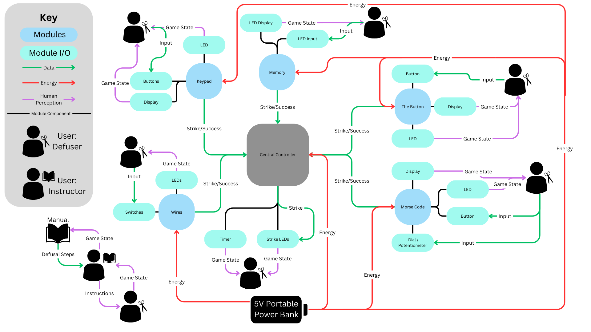

# Process

## Data Energy Flow Diagram

A few notes to make this diagram a little clearer:
- There are only 2 users of the game, so all the users with scissors (defuser) are the same person.
- The pink 'Human Perception' lines are meant to reprisent a flow of data that is aquired or transmitted through human perception. This differs from our normal green 'Data' lines because there are no mistakes in transmitting that data, whereas with a human perception line, mistakes can (and will) be made, which is an intentional design decision of our game.
- The small seperated piece of the diagram in the bottom left is the system between the two users. The instructor gets information from the manual, then transmits that to the defuser, while the defuser is transmitting data regarding the game state to the instructor. 

- Additional system diagrams as appropriate
    - Include diagrams that your team has made that depict relationships between components of your subsystems
        - These may include electronics schematics, CAD renderings, code UML diagrams, and/or hand-drawings that help us understand connections within and between your software, electrical, and mechanical components.